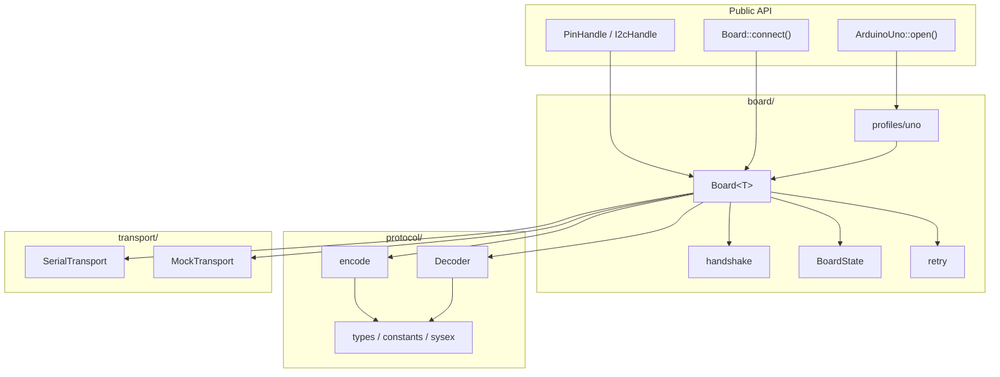
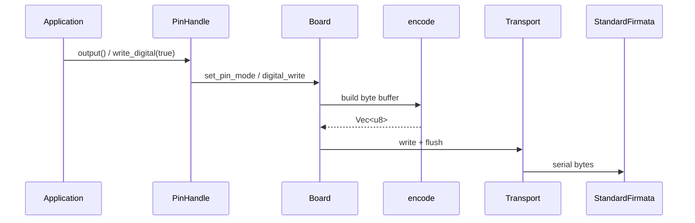
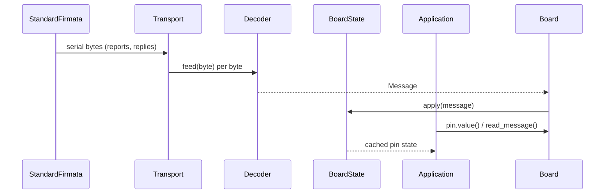
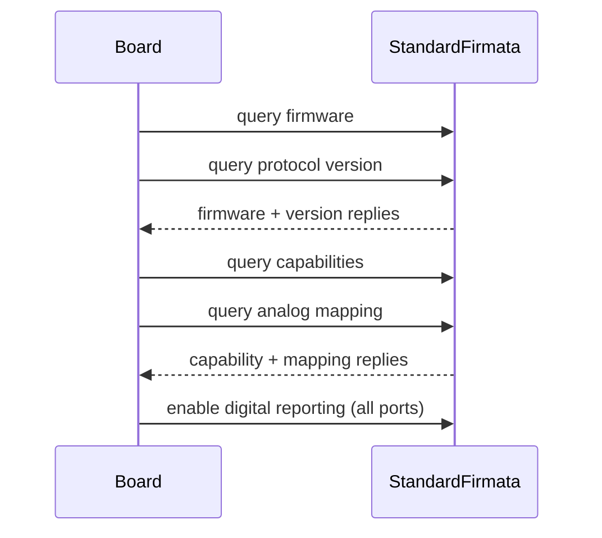

# firmata-board Architecture

Rust host adapter for Firmata-compatible boards running **StandardFirmata**, built on the [Firmata protocol](https://github.com/firmata/protocol) and `serialport`.

See **[docs/exploring-firmata-board.md](exploring-firmata-board.md)** for a hands-on walkthrough and examples that complement this architecture overview.

The crate separates three concerns:

1. **Protocol** — pure encode/decode of Firmata 2.5 bytes
2. **Transport** — serial I/O (or any `Read + Write` for testing)
3. **Board** — handshake, pin state, typed API with board profiles

Sync-first. Async may be added later without changing the protocol layer.

---

## Host vs device

Two programs run in the stack. `firmata-board` runs on the host; StandardFirmata runs on the MCU.

| Side | Runs on | What it is | Who maintains it |
|------|---------|------------|------------------|
| **Host** | PC / Pi / etc. | `firmata-board` (this crate) | You |
| **Device** | Arduino Uno MCU | StandardFirmata firmware | Arduino / Firmata project |

`firmata-board` does not execute on the microcontroller. It sends Firmata bytes over serial; the firmware turns those into `pinMode`, `digitalWrite`, `analogRead`, I2C, etc. on the chip.

```
┌─────────────────────────────────────────────────────────────────────────┐
│  Host (Rust)                                                            │
│                                                                         │
│  ┌──────────────┐   ┌──────────────┐   ┌─────────────────────────────┐  │
│  │ ArduinoUno   │   │ PinHandle    │   │ Board<T>                    │  │
│  │ PinHandle    │──►│ d() / a()    │──►│ handshake · state · retry   │  │
│  │ I2cHandle    │   │ typed API    │   │ send / read_message         │  │
│  └──────────────┘   └──────────────┘   └──────────────┬──────────────┘  │
│                                                       │                 │
│                       ┌──────────────────────────────▼──────────────┐  │
│                       │ protocol/  encode · decode · types · sysex  │  │
│                       └──────────────────────────────┬──────────────┘  │
│                                                       │                 │
│                       ┌──────────────────────────────▼──────────────┐  │
│                       │ transport/  serialport or MockTransport   │  │
│                       └──────────────────────────────┬──────────────┘  │
└──────────────────────────────────────────────────────┼────────────────┘
                                                         │ USB / UART
                                                         │ Firmata 2.5 bytes
┌──────────────────────────────────────────────────────▼────────────────┐
│  Device (Arduino Uno)                                                   │
│                                                                         │
│  ┌──────────────────────────────────────────────────────────────────┐  │
│  │ StandardFirmata (C++)                                            │  │
│  │ parse Firmata → pinMode · digitalWrite · analogRead · Wire · …   │  │
│  └──────────────────────────────────────────────────────────────────┘  │
└─────────────────────────────────────────────────────────────────────────┘
```

---

## Layer dependencies

Dependencies flow downward only. The protocol layer has no knowledge of boards or I/O.



---

## Stack (summary)

```
Host (Rust)                         Device (Arduino)
─────────────                       ────────────────
ArduinoUno / PinHandle              StandardFirmata (C++)
    ↓                                   ↑
Board (handshake, state)            digitalWrite, analogRead, etc.
    ↓                                   ↑
protocol encode/decode  ──serial──►  Firmata firmware
    ↓
Transport (serialport / mock)
```

---

## Modules

### Protocol (`src/protocol/`)

Pure Rust, no I/O.

| Module | Role |
|--------|------|
| `constants.rs` | Firmata command bytes and pin mode values |
| `types.rs` | `Message`, `PinMode`, `PinState`, `I2cReply` |
| `encode.rs` | Build outgoing byte buffers |
| `decode.rs` | Incremental `Decoder` — feed bytes, get `Message` |
| `sysex.rs` | 7-bit SysEx encoding helpers |

The decoder is incremental: `feed(byte)` returns `Ok(None)` until a full message is ready. State updates happen in `BoardState::apply`, not inside the decoder.

### Transport (`src/transport/`)

| Module | Role |
|--------|------|
| `mod.rs` | `Transport` trait (`Read + Write + flush_transport`) |
| `serial.rs` | `SerialTransport` via `serialport` (feature `serial`) |
| `mock.rs` | In-memory transport for unit tests |

### Board (`src/board/`)

| Module | Role |
|--------|------|
| `mod.rs` | `Board<T>` — connect, send, read_message, pin ops |
| `handshake.rs` | Init loop with timeout |
| `state.rs` | Pin cache, firmware metadata, I2C replies |
| `retry.rs` | Retry helper (transient I/O errors only) |
| `profiles/uno.rs` | Arduino Uno constants and `ArduinoUno::open()` |

### Pin API (`src/pin/`)

Typed interface over Firmata pin numbers:

- `d(n)` / `a(n)` — digital D0–D13, analog A0–A5
- `PinHandle` — `.output()`, `.pwm()`, `.write_digital()`, `.enable_reporting()`, etc.
- `I2cHandle` — `.config()`, `.write()`, `.read()`

---

## Data flow

### Outbound (host → device)



### Inbound (device → host)



### Handshake (on connect)



**Outbound (text):** `PinHandle` → `encode::*` → `Transport::write` → serial → Arduino

**Inbound (text):** serial → `Decoder::feed` → `Message` → `BoardState::apply` → `pin.value()`

---

## Public API

```rust
// Serial (default)
let mut uno = ArduinoUno::open("/dev/ttyACM0")?;
uno.pin(d(13)).output()?.write_digital(true)?;
uno.pin(a(0)).analog_input()?.enable_reporting()?;

// Custom transport (testing)
let board = Board::connect(MockTransport::new())?;
```

---

## Module layout

```
src/
  lib.rs
  error.rs
  protocol/
  transport/
  board/
    profiles/uno.rs
  pin/
```

---

## Cargo features

```toml
[features]
default = ["serial"]
serial = ["dep:serialport"]
```

---

## Tech stack

| Concern | Choice |
|---------|--------|
| Serial I/O | `serialport` 4.x (optional, default on) |
| Errors | `snafu` |
| Logging | `tracing` |
| Retry | `backoff` (transient I/O only) |
| Testing | mock transport + golden-byte tests |

---

## Roadmap

- Mega / Nano board profiles
- Optional async (`tokio-serial`)
- Hardware-in-the-loop CI
